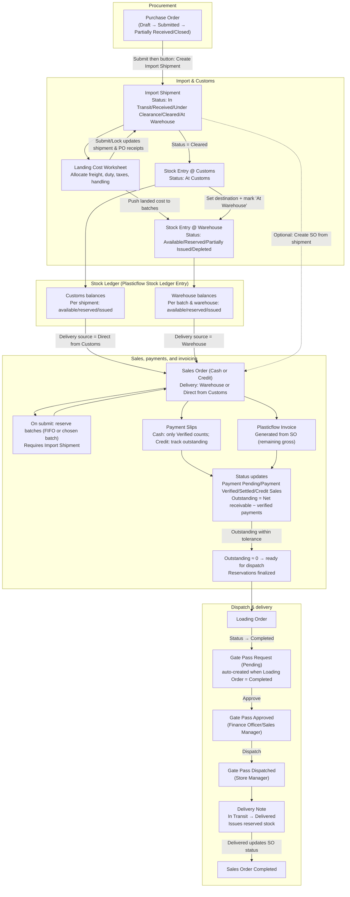

# PlasticFlow end-to-end workflow

Copy the Mermaid block into any viewer (e.g., GitHub, Mermaid Live Editor, or the Frappe Markdown preview) to render the flow chart for training sessions.

```mermaid
flowchart TD
  subgraph Procurement
    PO["Purchase Order<br/>(Draft → Submitted → Partially Received/Closed)"]
  end

  subgraph Import_and_Customs["Import & Customs"]
    IS["Import Shipment<br/>Status: In Transit/Received/Under Clearance/Cleared/At Warehouse"]
    LCW["Landing Cost Worksheet<br/>Allocate freight, duty, taxes, handling"]
    SEC["Stock Entry @ Customs<br/>Status: At Customs"]
    SEW["Stock Entry @ Warehouse<br/>Status: Available/Reserved/Partially Issued/Depleted"]
  end

  subgraph Ledger["Stock Ledger (Plasticflow Stock Ledger Entry)"]
    LEDC["Customs balances<br/>Per shipment: available/reserved/issued"]
    LEDW["Warehouse balances<br/>Per batch & warehouse: available/reserved/issued"]
  end

  subgraph Sales_and_Payments["Sales, payments, and invoicing"]
    SO["Sales Order (Cash or Credit)<br/>Delivery: Warehouse or Direct from Customs"]
    Reserve["On submit: reserve batches (FIFO or chosen batch)<br/>Requires Import Shipment"]
    PS["Payment Slips<br/>Cash: only Verified counts; Credit: track outstanding"]
    INV["Plasticflow Invoice<br/>Generated from SO (remaining gross)"]
    Settle["Status updates<br/>Payment Pending/Payment Verified/Settled/Credit Sales<br/>Outstanding = Net receivable − verified payments"]
    Ready["Outstanding ≈ 0 → ready for dispatch<br/>Reservations finalized"]
  end

  subgraph Dispatch_and_Delivery["Dispatch & delivery"]
    LO["Loading Order"]
    GPRq["Gate Pass Request (Pending)<br/>auto-created when Loading Order = Completed"]
    GPRa["Gate Pass Approved<br/>(Finance Officer/Sales Manager)"]
    GPRd["Gate Pass Dispatched<br/>(Store Manager)"]
    DN["Delivery Note<br/>In Transit → Delivered<br/>Issues reserved stock"]
    Done["Sales Order Completed"]
  end

  PO -->|"Submit then button: Create Import Shipment"| IS
  IS -->|"Status = Cleared"| SEC
  IS --> LCW
  LCW -->|"Submit/Lock updates shipment & PO receipts"| IS
  LCW -->|"Push landed cost to batches"| SEW
  SEC -->|"Set destination + mark 'At Warehouse'"| SEW
  SEC --> LEDC
  SEW --> LEDW

  LEDC -->|"Delivery source = Direct from Customs"| SO
  LEDW -->|"Delivery source = Warehouse"| SO
  IS -. "Optional: Create SO from shipment" .-> SO

  SO --> Reserve
  Reserve --> SO
  SO --> PS
  SO --> INV
  PS --> Settle
  INV --> Settle
  Settle -->|"Outstanding within tolerance"| Ready

  Ready --> LO
  LO -->|"Status → Completed"| GPRq
  GPRq -->|"Approve"| GPRa
  GPRa -->|"Dispatch"| GPRd
  GPRd --> DN
  DN -->|"Delivered updates SO status"| Done
```
